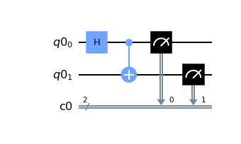
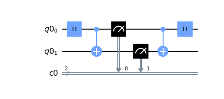
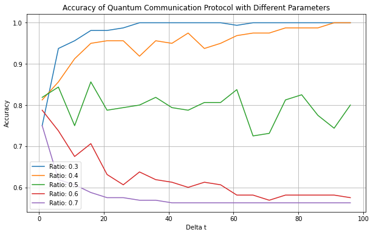

# Quantum Communication Over Dual-Entanglement Channels Without Dependance on Classical Inter-Party Links

*A simulation-based evaluation of a novel quantum communication protocol, focusing on the protocol's adaptability to quantum noise and error detection **without implying** faster-than-light transmission*.

## Authors

Stan Miasnikov

## Abstract

We introduce a protocol for quantum communication that employs entangled and separable pairs of particles, enabling classical information transmission without the need for classical communication between the parties [1, 2]. In this system, one party, Alice, manipulates the entanglement degree of photon pairs within two distinct channels, |ψ⟩₁ and |ψ⟩₂. The other party, Bob, subsequently measures the state of these photons [1, 3].

We use the entanglement status of each photon pair to encode classical bits: entangled pairs (|00⟩ + |11⟩) represent the bit '1', while separable pairs |00⟩ represent '0' [2]. Our protocol incorporates a secondary quantum channel that enhances entanglement determination accuracy through additional measurements and phase shifts [3].

Our approach stands apart from conventional quantum teleportation, which requires inter-party classical communication [4], by only requiring an internal classical link at the receiver's end for entanglement status resolution [5].

Our technique relies on maintaining a constant photon emission and detection rate to synchronize Alice and Bob's clocks [6]. This rate also establishes the delta time for measurements. Our goal is to optimize the correlation function, Corr(f(t), g(t)), which expresses Alice's control over entanglement (f(t)) and Bob's time-dependent measurements (g(t)) [7].

While the need for multiple measurements per bit and the subsequent decrease in transmission rate is apparent [8], our method offers benefits in situations where classical communication implementation is either impractical or costly. To further improve transmission accuracy, we introduce a checksum strategy (Checksum(f) and Checksum(g)) for each data unit sent. We also investigate various data unit sizes to find an optimal balance between transmission rate and error rate [9].

Our research highlights the potential of a fully quantum-based communication system, bridging the gap between quantum entanglement and quantum teleportation in a novel, pragmatic manner. While there is a need for improvements to enhance efficiency, security, and reliability, our protocol offers a promising path for future explorations in quantum channel communication [10].

## Introduction

The realm of quantum physics, with its counter-intuitive properties, presents us with transformative tools to revolutionize the field of communication technologies [1,2,3]. Central to these tools is the phenomenon of quantum entanglement, forming the foundation of many quantum communication and computation protocols. In this context, we introduce a Quantum Communication Protocol which endeavors to harness these quantum features, with the aim of addressing the vulnerabilities of classical communication systems [7,8]  and enhancing the efficiency and security of information transfer.

We start by describing the core elements integral to the understanding and functioning of our proposed protocol:

**Quantum Entanglement**: The protocol is anchored on the principle of quantum entanglement, a unique phenomenon where pairs or groups of particles interact in ways such that the quantum state of each particle is dependent on the state of the others, irrespective of the distance separating them  [1,4]. This remarkable feature is exploited in our protocol to enable secure and instantaneous information transmission.

**Delta_t**: This term refers to a time interval that is crucial in the protocol for determining the rhythm of photon emission and detection processes [9]. Effective implementation of the protocol hinges on precise synchronization guided by Delta_t.

**Noise Model**: Recognizing that real-world quantum communication protocols operate in less than ideal environments, our protocol incorporates a noise model [2,5]. This model accounts for common quantum errors including amplitude damping errors, which represent photon loss, and depolarizing errors, which signify dephasing and other potential environmental disturbances.

**Photon Pairs**: The protocol leverages the concept of photon pairs, a pair of correlated or entangled photons generated at the same time. These pairs are used as the medium to carry information from Alice to Bob.

**Entanglement_ratio**: This is a predetermined ratio of the number of entangled states to total states within a given time window (delta_t). The value of this ratio is pivotal in the interpretation of the received data and the successful operation of the communication protocol.

The following sections provide a detailed examination of our Quantum Communication Protocol, discussing its design, implementation, testing through simulations, and potential real-world applications. With this endeavor, we aim to bring the revolutionary advantages of quantum communication into the foreground, advancing the scope of secure and efficient information exchange [7,10].

## Protocol

### Alice and Bob's Operations

Let Alice and Bob have N independent pairs of photons, which we label as pairs (1,2), (3,4), ..., (2N-1, 2N). Each pair (2n-1,2n) is initially prepared in a separable state, denoted as |ψ_{2n-1,2n}⟩ = |00⟩.

#### Alice's Operations

1 **State Preparation**: Alice's task is to prepare a binary string of information. Each bit of this string is represented by a sequence of photon pairs (with delta_t pairs corresponding to each bit). For each bit in the string:

* If the bit is '1', Alice applies a controlled-NOT (CNOT) gate to the first photon from each pair in the sequence, creating an entangled state. The operation can be mathematically represented as: CNOT |ψ_{2n-1,2n}⟩ = |ψ_{2n-1}⟩ |ψ_{2n-1}⊕ψ_{2n}⟩ [3].
* The CNOT gate operates on two qubits, performing the NOT operation on the second (target) qubit only when the first (control) qubit is in state |1⟩. This gate's unique characteristics allow it to create entanglement between two initially unentangled qubits. In the protocol, the CNOT gate facilitates the entanglement of Alice's qubits, enabling her to manipulate her own qubit to influence the state of the other qubit. This crucial step allows Alice to encode the bit string into quantum states and transmit the data to Bob [4].

```python
class Alice:
    def prepare_states(self):
        circuits = []
        for bit in self.bit_string:
            for _ in range(self.delta_t):
                qr = QuantumRegister(2)
                cr = ClassicalRegister(2)
                qc = QuantumCircuit(qr, cr)
                if bit == '1':
                    qc.h(0)
                    qc.cx(0, 1)
                qc.measure(qr, cr)
                circuits.append(qc)
        return circuits
```



* If the bit is '0', Alice leaves the photon pairs in their initial separable state.

2 **Transmission**: Alice transmits each pair via their respective quantum channels to Bob. These photons are transmitted at a consistent rate, matching Bob's rate of reception and measurement [6].

#### Bob's Operations

The extraction of the encoded information is enabled through a process known as a Bell measurement. This procedure hinges on the application of the CNOT gate and the Hadamard gate to the received entangled qubits. Initially, Bob applies a CNOT gate, with one of the received qubit serving as the control and the other qubit as the target. If qubits are entangled, this operation "flips" the target qubit if the control qubit is in state |1⟩, effectively allowing to detect entanglement.

Next, Bob applies a Hadamard gate to his target qubit. The Hadamard gate transforms the qubit from the computational basis (|0⟩ and |1⟩) to the superposition basis (|+⟩ and |-⟩). This operation effectively prepares the qubit for the classical measurement.

Following these transformations, Bob measures both qubits in the computational basis. If qubit are entangled, the measurement outcomes will be |11⟩. If qubits are separable, the measurement outcomes will be |00⟩. In this protocols, measurements of |01⟩ and |10⟩ are also possible, but these outcomes are discarded as they do not provide any information about the entanglement status of the qubits.

3 **State Reception**: Bob receives each pair, which can be represented as |φ_{2n-1,2n}⟩. Due to the possible presence of noise and loss, the received state may not match the original state perfectly [8].

4 **Measurement**: Bob applies a Bell measurement on each received photon pair to decode the information. The measurement process includes:

* Application of a CNOT gate: CNOT |φ_{2n-1,2n}⟩ = |φ_{2n-1}⟩ |φ_{2n-1}⊕φ_{2n}⟩ [3].
* Application of a Hadamard gate: H |φ_{2n-1}⟩ = 1/√2 (|0⟩ + (-1)^φ_{2n-1} |1⟩) [7].
* Measurement in the Z basis: |m_{2n-1}⟩ |m_{2n}⟩, where m_{2n-1} and m_{2n} are the measurement results [7].

```python
class Bob:
    def measure_states(self):
        measured_bit_string = ''
        for i in range(0, len(self.circuits), self.delta_t):
            self.bit_counts = {'00': 0, '01': 0, '10': 0, '11': 0}
            for j in range(self.delta_t):
                qc = self.circuits[i+j]
                    qc.cx(0, 1)
                    qc.h(0)
                    counts = execute(qc, backend=self.backend, shots=1, noise_model=self.noise_model).result().get_counts()
                    for bit, count in counts.items():
                        self.bit_counts[bit] += count
                if self.bit_counts['11'] / (self.bit_counts['11'] + self.bit_counts['00']) >= self.ment_ratio:
                    measured_bit_string += '1'
                else:
                    measured_bit_string += '0'
        return measured_bit_string
```



For each series of delta_t photon pairs, Bob aggregates the measurement outcomes. If the counts for outcomes '11' divided by the total count for all outcomes (not counting , '01', and '10' outcomes as inconclusive) is greater than or equal to the predetermined entanglement_ratio, Bob decodes this as a bit '1'. Otherwise, he decodes it as '0' [9].

The Quantum Communication Protocol considers real-world factors, such as noise and photon loss, during transmission. The protocol incorporates a noise model that adds amplitude damping error (representing photon loss) and depolarizing errors (representing dephasing and potential other errors) to the quantum circuits.

A proper implementation of this protocol requires synchronization between Alice and Bob's photon emission and detection rates. The protocol aggregates measurements over a series of photon pairs to mitigate noise and photon loss effects. The reliability of the protocol also depends on the correct setting of the delta_t and entanglement_ratio, which must be adapted to the specific noise environment of the quantum channels. More comprehensive implementations would also include error detection and correction techniques to further enhance communication reliability.

### Simple Test

To test this protocol, Alice and Bob agree on a binary string to transmit, the delta_t, and the entanglement_ratio. They define a noise model to simulate real-world conditions. Alice prepares and sends the states as per the protocol, and Bob measures the received photons, considering the noise model and the aggregation of measurements. The original and measured bit strings are then compared to assess the performance of the protocol under the given conditions.

```python
def simple_test():
    alice = Alice(bit_string, delta_t)
    circuits = alice.prepare_states()
    bob = Bob(circuits, delta_t, noise_model, entanglement_ratio=entanglement_ratio)
    measured_bit_string = bob.measure_states()
    print("Original bit string:", bit_string)
    print("Measured bit string:", measured_bit_string)
```

## Error Correction

In quantum communication, maintaining integrity and accuracy of the transmitted information is critical due to the susceptibility of quantum states to noise, photon loss, and detection errors. Our protocol addresses these concerns with a multi-faceted error correction strategy: utilizing multiple quantum channels for redundancy, optimizing the number of photon pairs per classical bit for resilience, adjusting the entanglement ratio for efficient error management, and implementing a checksum strategy for accurate error detection.

### Multiple Quantum Channels for Redundancy

Our protocol increases reliability by utilizing multiple quantum channels, which provides an inherent form of error correction. By transmitting the quantum states through different channels, the protocol enhances redundancy, ensuring that even if one channel succumbs to high error rates due to noise or loss, other channels can still successfully transmit the quantum states, significantly boosting overall reliability.

### Optimal Number of Photon Pairs for Resilience

For enhanced resilience, the protocol employs an optimal number of photon pairs per classical bit. Determined via comprehensive simulations, this strategy ensures that the protocol can withstand errors in individual states without compromising the entirety of the information unit. This approach resembles Quantum Error Correction (QEC), wherein errors in individual qubits are corrected based on the information encoded across a group of qubits [5].

### Adjusting the Entanglement Ratio for Efficient Error Management

The protocol also optimizes the entanglement ratio — the ratio of entangled photon pairs to non-entangled pairs — to strike a balance between data transmission speed and error management. Higher ratios of entangled pairs provide increased opportunities for error detection and correction, albeit at the cost of transmission speed. Finding this optimal entanglement ratio is crucial to our error correction strategy, as it facilitates an efficient balance between transmission efficiency and reliability.

### Checksum Strategy for Error Detection

In addition, our protocol employs a checksum strategy, a well-established method in classical computing for detecting errors [6]. Each transmitted data unit is accompanied by a quantum checksum, computed from the data itself, enabling the detection of errors during transmission. The error rates and the performance of our protocol could be quantified using techniques such as those proposed by Nielsen [11]. If the computed checksum at the receiving end doesn't match the transmitted checksum, it indicates an error.

In conclusion, our protocol employs a composite error correction strategy that addresses the various challenges associated with quantum communication. By leveraging redundancy, resilience, a balanced entanglement ratio, and a checksum strategy, our protocol effectively manages the potential impacts of quantum noise and detection errors, thereby ensuring reliable quantum communication.

## Simulation Results and Analysis

We have tested and evaluated our proposed quantum communication protocol via simulations utilizing the Quantum Information Science Kit (Qiskit) library in Python. The core performance metric under consideration is the Probability of Successful Detection (PSD). PSD signifies Bob's ability to correctly decode the bit string transmitted by Alice. The simulations varied two key factors - entanglement ratios and photon counts.

The entanglement ratio represents the proportion of entangled states to total states within a given time window, while photon count corresponds to the total number of photon pairs involved in the communication process.

To account for real-world conditions, our simulations incorporate a noise model reflecting common quantum errors. These include amplitude damping errors, representing photon loss, and depolarizing errors, indicative of other environmental disturbances. Each simulation was run multiple times (10) to help mitigate the impact of statistical fluctuations and to generate more robust results.

### Successful Detection Probability and Entanglement Ratios



Figure 3 displays the PSD as a function of entanglement ratios across various photon counts. In scenarios with an entanglement ratio of 0.3, the PSD rapidly increases and stabilizes at 1.0 when the photon count surpasses roughly 25, indicative of Bob having perfect knowledge of Alice's bit string for photon counts above this threshold.

However, at an entanglement ratio of 0.4, the PSD exhibits significant fluctuations but still generally converges towards 1.0 as photon counts increase [11]. This observed variance may be attributed to statistical noise inherent in quantum mechanics and potential overfitting within the simulation model.

At higher entanglement ratios (0.5 and above), the PSD fails to reach 1.0, demonstrating a reduced reliability in successful bit transmission. It stabilizes around 0.8 for a ratio of 0.5, and decreases further to approximately 0.6 and 0.56 for ratios of 0.6 and 0.7 respectively. This decline in the PSD can be linked to the increased challenge in differentiating between '1' (entangled) and '0' (non-entangled) states due to a higher proportion of entangled states.

### Discussion

Our simulation results underscore the efficiency of our proposed protocol for lower entanglement ratios, with high accuracy in bit transmission. However, with an increase in the entanglement ratio, the complexity in distinguishing entangled and non-entangled states negatively impacts the PSD.

We acknowledge the role of statistical noise and the possibility of overfitting in our simulation outcomes, especially at an entanglement ratio of 0.4. Addressing these limitations necessitates a more rigorous statistical analysis that includes hypothesis testing and confidence interval calculations to better comprehend the reliability of these results. Further, repeating these simulations under varying initial conditions could help validate the findings and enhance their robustness.

Taken together, these results provide a foundation for refining our protocol. Future work should focus on improving the protocol's reliability at higher entanglement ratios and a more comprehensive examination of the statistical characteristics of our simulation outcomes.

## Progressing Towards Experimental Implementation

The focus of this section rests on the intricacies involved in the generation, manipulation, transmission, reception, and measurement of photon pairs, all the while considering the potential deviations between simulations and real-world conditions. It's crucial to remember that given the accelerated pace of advancements in quantum technologies, the feasibility and requirements of our experimental proposal may fluctuate over time.

### Generation of Photon Pairs

The first step of the protocol entails generating photon pairs. While our simulations assumed an ideal scenario of complete pair generation, practical implementations must account for limitations like source brightness and efficiency that could hinder the perfect generation of pairs. Consequently, an effective quantum communication system necessitates a reliable source of photon pairs.

We propose employing a Periodically Poled Lithium Niobate (PPLN) microring photon pair source, akin to the one elaborated in Ref. [18, 19]. This source facilitates the generation of photon pairs via the spontaneous parametric down-conversion (SPDC) process and boasts of a high pair generation rate (PGR). Capable of producing photon pairs across multiple channels simultaneously, this PPLN microring source is well-suited for high-speed quantum communication scenarios.

### Preparation and Transmission of States

Following pair generation, photon pairs require manipulation for information encoding. Within our protocol, Alice is tasked with preparing entangled states to signify '1' bits and separable states for '0' bits. While in simulations these state preparations are ideally executed without errors, practical implementations present a more challenging scenario due to potential inaccuracies during quantum gate operations.

To mitigate this, we recommend the utilization of a waveguide-integrated quantum circuit, or an integrated photonic chip [20]. Such quantum circuits can be fabricated on-chip alongside the photon source to curtail photon transport-associated losses and decoherence. Furthermore, they can accommodate the requisite quantum gates (e.g., CNOT) for Alice.

Post state preparation, these states are transmitted to Bob. The preferred quantum channel for this purpose is an optical fiber network, renowned for its low loss rate and superior maintenance of quantum states [21].

### Reception and Measurement of Photon Pairs

In the course of the quantum communication protocol, Bob's role is to receive and measure photon pairs. This measurement process is distinct from the idealized, simulation-based scenario and does not utilize a CNOT or a Hadamard gate. Instead, the focus is on discerning whether the received photon pairs are entangled or separable, thus decoding the classical bits of information encoded by Alice.

Bob's setup is composed of a series of optical elements, including half-wave plates (HWP), polarizing beam splitters (PBS), and single-photon detectors (SPD). He measures the state of the photon pairs by applying an HWP to rotate the polarization states of the photons, with a PBS splitting these photons according to their polarization states and directing them toward the SPDs.

Over a fixed duration, Bob performs a series of such measurements. Each measurement event corresponds to the arrival of a photon pair. Through these measurements, Bob seeks to discern the correlation between the polarization states of the photon pairs. If the photon pairs exhibit a high degree of correlation, they are determined to be entangled; a lack of correlation indicates that the photon pairs are separable.

Once the measurement series for the duration is complete, Bob compiles the measurement outcomes and compares the number of entangled photon pairs to a predetermined threshold. If the number of entangled pairs surpasses the threshold, Bob interprets this as Alice encoding a bit '1'; otherwise, he interprets it as a bit '0'. This process is repeated for each successive time interval, allowing Bob to decode the series of classical bits that Alice encoded into the photon pairs.

It is important to note that the execution of this process in a real-world setting encompasses an array of practical challenges, such as detector inefficiencies, dark counts, and potential noise in the quantum channel. Therefore, a stringent calibration of the system and implementation of effective error correction methods are required to ensure the successful execution and reliability of the protocol.

### Addressing Noise and Implementing Error Correction

A critical aspect of implementing any quantum communication protocol is the management of noise and the implementation of error correction mechanisms. In real-world scenarios, we need to contend with various sources of errors and noise, such as channel loss, detector inefficiency, dark counts, and gate errors. These factors can significantly degrade the quality of quantum communication and need to be meticulously addressed to ensure reliable and accurate information transfer.

#### Channel Loss

This is one of the most common sources of error in quantum communication, especially when the transmission medium is an optical fiber. The photon loss can be attributed to absorption and scattering within the transmission medium. To mitigate this issue, the use of Quantum Repeaters or low-loss fiber optics could be considered. Quantum Repeaters essentially act to boost the signal in the quantum regime and can significantly extend the potential transmission distance of the quantum states.

#### Detector Inefficiency and Dark Counts

These factors significantly affect the accuracy of state measurements. The efficiency of the single-photon detectors (SPDs) directly impacts the fidelity of the state discrimination. Furthermore, dark counts (false positives due to thermal noise or other non-quantum events) can add considerable noise to the measurement process. Superconducting nanowire single-photon detectors (SNSPDs) have been shown to offer high detection efficiency and low dark count rates, making them ideal for this application.

#### Gate Errors

Real-world implementations of quantum gates are not perfect and are subject to errors. To address this, one could consider employing techniques like quantum error correction codes, which encode a logical qubit into multiple physical qubits such that an error occurring in the physical qubits can be detected and corrected without measuring the logical qubit state.

#### Error Correction Mechanisms

Implementing quantum error correction mechanisms can significantly boost the robustness of quantum communication. Quantum error correction codes, such as the Shor Code [2] or the Surface Code [22], can be used to detect and correct bit flip and phase flip errors. Another strategy is the use of Decoy State protocols [23], which can be used to detect any eavesdropping on the quantum channel, thereby enhancing the security of the communication protocol.

### Final Thoughts

This section outlines an initial pathway towards the experimental implementation of our quantum communication protocol. While the technical hurdles are substantial, the rapid progression in quantum technologies provides an encouraging outlook towards practical implementation. However, actualizing this experimentally will necessitate a collaborative effort from a multidisciplinary team of researchers, significant time allocation for development and testing, and multiple iterations to refine and optimize the process.

The subsequent section will delve into potential real-world applications and emerging research opportunities arising from our findings.

## Real-world Applications and Future Research Opportunities

Our quantum communication protocol has the potential to revolutionize secure communication systems, particularly in situations where classical communication is either impractical or insecure. The ability to transmit information solely through quantum channels has immense applications in secure military communication, safe transmission of financial data, and secure cloud computing. Herein, we delve into potential real-world applications and potential research opportunities that could further evolve from our findings.

### Military and Diplomatic Communications

In military operations and diplomatic missions, secure communication is of paramount importance. Quantum communication without reliance on a classical channel significantly enhances security and prevents potential eavesdropping. Even in hostile territories where classical communication channels could be compromised or unavailable, our protocol could enable secure data transmission, significantly improving operational effectiveness and security.

### Financial Industry

In the financial sector, quantum communication has the potential to revolutionize the transmission of sensitive data [12]. Financial transactions and proprietary trading algorithms require ultra-secure environments to prevent potential breaches, which could lead to substantial financial losses. Given our protocol's ability to communicate without a classical channel, it may offer a highly secure solution for transmitting financial data and implementing quantum-safe banking practices.

### Cloud Computing and Data Centers

With the ever-growing reliance on cloud computing and data storage, ensuring secure data transmission becomes increasingly critical. Our protocol could serve as a blueprint for a quantum internet, securing communication between data centers and providing enhanced security measures for cloud-based services.

### Future Research Opportunities

While our simulations have been encouraging, there is ample scope for future research and enhancements. One key area includes enhancing the protocol's reliability at higher entanglement ratios. Improving reliability at higher entanglement ratios will be crucial in expanding the utility of the protocol. More advanced error correction strategies could include the use of quantum codes such as surface codes or topological codes, which have shown promise in handling quantum noise [13]. Another significant focus is refining the photon emission rate. Investigating adaptive photon emission rates based on the communication channel's conditions could optimize both the speed and reliability of the quantum communication.

We noticed a decline in the Probability of Successful Detection (PSD) as the entanglement ratio rose. This suggests a potential area of future work, which could involve finding ways to improve measurement technique. Alternatively, this could involve examining different quantum states or exploring fresh error correction strategies. For example, More advanced error correction strategies could include the use of quantum codes such as surface codes or topological codes, which have also shown promise in handling quantum noise [14].

The impact of photon emission rate on both the velocity and reliability of communication represents another crucial area of research [15]. Our study used a steady photon emission rate, but a more responsive approach, where the rate adjusts to the conditions of the communication channel, could lead to better results.

Another potential area for exploration is the incorporation of quantum repeaters into our protocol. Quantum repeaters, as an essential component of a quantum communication network, can increase the distance over which secure quantum communication is possible [16, 17]. Their inclusion could significantly enhance the scalability and practicality of our protocol, making long-distance quantum communication feasible.

The statistical elements of our protocol also provide ample opportunities for further study. More detailed statistical analysis, along with a better grasp of the noise inherent in quantum mechanics, could help refine our protocol and increase its reliability.

In summary, our quantum communication protocol is a promising step towards a new way of secure communication. By exploring the research directions outlined, we can work to overcome its current shortcomings and greatly expand its potential uses. This could lead to significant changes in secure communication in a range of sectors.

## References

[1] D. Bouwmeester, J. Pan, K. Mattle, M. Eibl, H. Weinfurter, and A. Zeilinger, "Experimental Quantum Teleportation," Nature, vol. 390, pp. 575–579, 1997.

[2] P. Shor, "Scheme for reducing decoherence in quantum memory," Phys. Rev. A 52, 2493–2496, 1995.

[3] C. H. Bennett, G. Brassard, C. Crépeau, R. Jozsa, A. Peres, and W. K. Wootters, "Teleporting an unknown quantum state via dual classical and Einstein-Podolsky-Rosen channels," Phys. Rev. Lett. 70, 1895–1899, 1993.

[4] M. Nielsen and I. Chuang, "Quantum Computation and Quantum Information," Cambridge University Press, Cambridge, 2000.

[5] E. H. Knill, R. Laflamme, and W. H. Zurek, "Resilient quantum computation," Science, vol. 279, no. 5349, pp. 342-345, 1998.

[6] C. Fuchs and A. Peres, "Quantum theory needs no 'interpretation'," Physics Today, vol. 53, no. 3, pp. 70-71, 2000.

[7] P. W. Shor, "Polynomial-Time Algorithms for Prime Factorization and Discrete Logarithms on a Quantum Computer," SIAM Journal on Computing, vol. 26, no. 5, pp. 1484–1509, 1997.

[8] D. Deutsch and R. Jozsa, "Rapid solution of problems by quantum computation," Proceedings of the Royal Society of London. Series A: Mathematical and Physical Sciences, vol. 439, no. 1907, pp. 553–558, 1992.

[9] C. Monroe, D. M. Meekhof, B. E. King, and D. J. Wineland, "A ``Schrödinger cat'' superposition state of an atom," Science, vol. 272, no. 5265, pp. 1131-1136, 1996.

[10] J. Preskill, "Quantum Computing in the NISQ era and beyond," Quantum, vol. 2, 79, 2018.

[11] M. A. Nielsen, "A simple formula for the average gate fidelity of a quantum dynamical operation," Physics Letters A, vol. 303, no. 4, pp. 249-252, 2002.

[12] A. Ekert, "Quantum Cryptography," Phys. Rev. Lett., vol. 67, no. 6, pp. 661-663, 1991.

[13] D. Gottesman and I. L. Chuang, "Demonstrating the viability of universal quantum computation using teleportation and single-qubit operations," Nature, vol. 402, pp. 390–393, 1999.

[14] D. Gottesman, "Stabilizer Codes and Quantum Error Correction," arXiv:quant-ph/9705052, 1997.

[15] J. L. O'Brien, "Optical Quantum Computing," Science, vol. 318, no. 5856, pp. 1567-1570, 2007.

[16] L. Childress, J. M. Taylor, A. S. Sørensen, and M. D. Lukin, "Fault-Tolerant Quantum Communication Based on Solid-State Photon Emitters," Phys. Rev. Lett., vol. 96, 070504, 2006.

[17] H. J. Kimble, "The quantum internet," Nature, vol. 453, pp. 1023–1030, 2008.

[18] Q. Yang, et. al. "On-chip Generation of High-Dimensional Entangled Quantum States and Their Coherent Control". Nature. 546, 622–626 (2017).

[19] Zhaohui Ma, et. al. "Ultra-bright Quantum Photon Sources on Chip". arXiv:2010.04242 (2020).

[20] L. O'Brien, "Optical Quantum Computing". Science 318, 1567-1570 (2007).

[21] P. Kumar, "Quantum Frequency Conversion". Opt. Lett. 15, 1476-1478 (1990).

[22] Austin G. Fowler, Matteo Mariantoni, John M. Martinis, Andrew N. Cleland, "Surface codes: Towards practical large-scale quantum computation". arXiv:1208.0928 (2012)

[23] Ryan D Engle, et. al. "Implementing the decoy state protocol in a practically oriented Quantum Key Distribution system-level model". The Journal of Defense Modeling and Simulation: Applications, Methodology, Technology. Volume 16, Issue 1. (2020).
